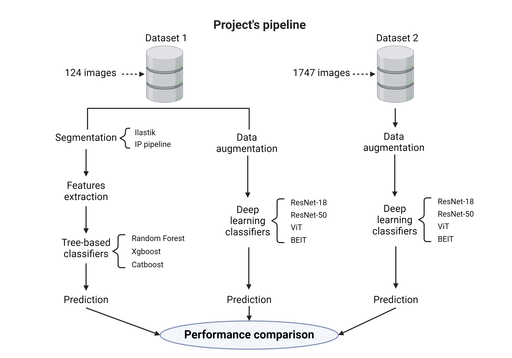
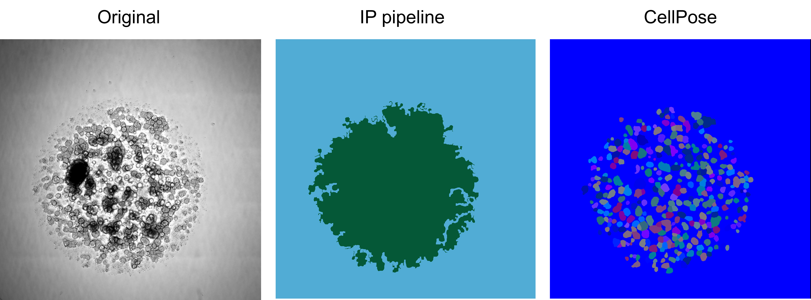
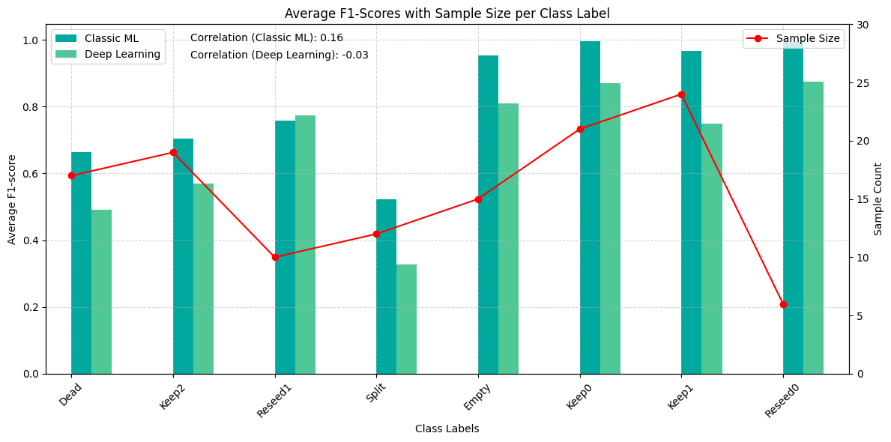

# Organoids Project 🧬  
**Machine Learning and Imaging-Based Feedback for Cancer Organoids Culture Automation**  

## Overview  
This project develops an automated system for classifying and monitoring the growth stages of cancer organoid cultures. By leveraging advanced computer vision and machine learning techniques, it aims to enhance the efficiency and accuracy of organoid culture processes, paving the way for improved cancer research and drug testing.

## Workflow Overview  
The project integrates advanced imaging and machine learning techniques. Below is an example of the proposed workflow:  

  

## Segmentation  
Comparison of organoid segmentation using different methods: CellPose vs IP:  



## Results  
Comparison of average F1-scores and sample size per class label for Classic ML and Deep Learning models:  



## Features  
- **Organoid Classification**: Automated classification of organoid growth stages using machine learning and deep learning models.  
- **Annotation GUI**: A custom-built tool for efficiently labeling organoid images.  
- **Visualization**: Dimensionality reduction plots and user interfaces for exploratory data analysis.  
- **Segmentation Techniques**: Robust image segmentation pipelines leveraging CellPose, Ilastik, and other methods.  

## Technologies  
- **Python**: Core programming language.  
- **Machine Learning**: XGBoost, CatBoost, Random Forests, and deep learning models like ResNet and ViT.  
- **Microscopy Data**: Zeiss Celldiscover 7 with Zen software for high-resolution image acquisition.  
- **Visualization Tools**: Plotly and Dash for user-friendly interfaces.  

## Setup and Installation  
1. Clone the repository:  
   ```bash  
   git clone https://github.com/lguertle/organoids-project.git

2. Install dependencies:  
   ```bash  
   pip install -r requirements.txt

3. Configure the settings in the config.yaml file for data paths and model parameters.

## License
This project is released under the MIT License.

## Contact
Created by Laurent Gürtler.
For inquiries, please email at laurent.guertler@gmail.com.

## Disclaimer
This project was developed for research purposes. The code may not work as expected, but it provides a useful overview of the overall approach and methodology.
